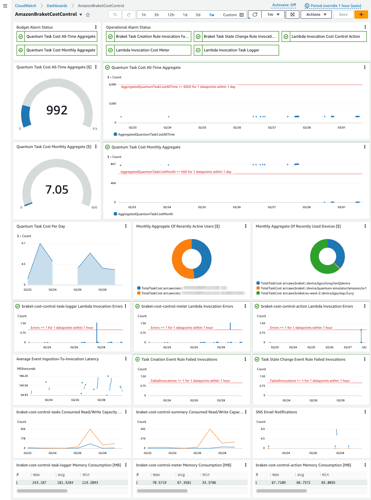
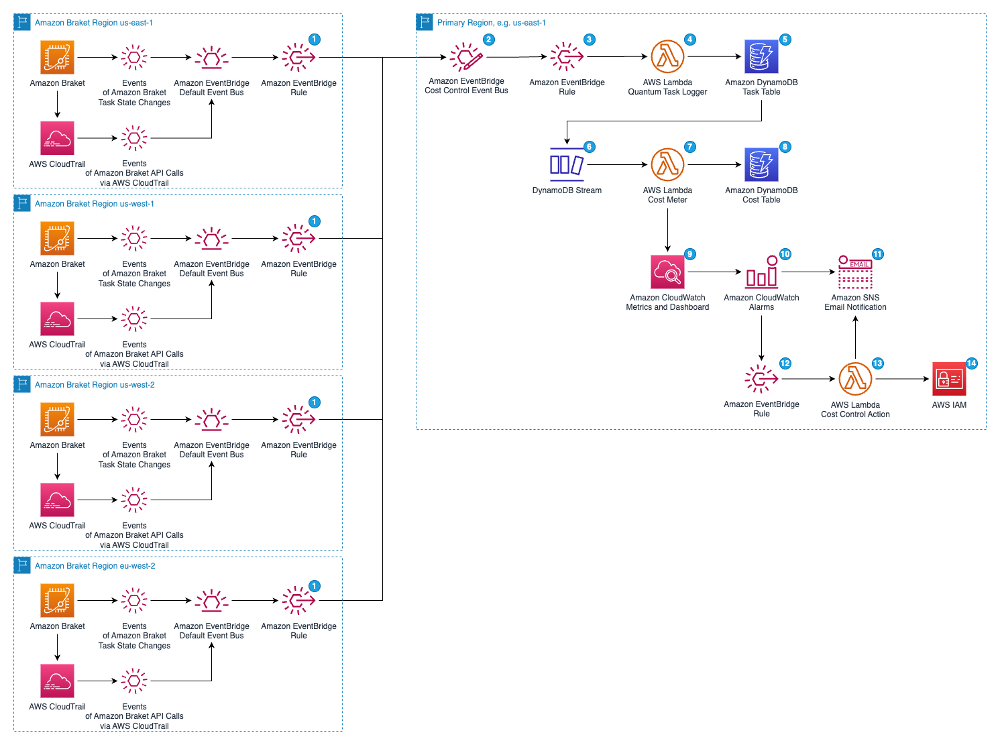

# Amazon Braket Cost Control Solution

This solution enables near real-time monitoring and control of costs incurred by [Amazon Braket](https://aws.amazon.com/braket/) quantum tasks. It records the cost of each individual quantum task created across all Amazon Braket regions in an AWS account and aggregates monthly cost by user identity and device as well as all-time cost since deployment. Cost and execution metrics are displayed in an [Amazon CloudWatch dashboard](https://docs.aws.amazon.com/AmazonCloudWatch/latest/monitoring/CloudWatch_Dashboards.html). Monthly and all-time budget limits can be configured and [Amazon CloudWatch alarms](https://docs.aws.amazon.com/AmazonCloudWatch/latest/monitoring/AlarmThatSendsEmail.html) send [Amazon Simple Notification Service (SNS)](https://aws.amazon.com/sns/) email notifications when limits are exceeded. In addition, permissions for creation of new quantum tasks can be automatically revoked for configurable [AWS IAM identities](https://docs.aws.amazon.com/IAM/latest/UserGuide/id.html) (users, user groups, and roles) when one of the alarms is in ALARM state.

The Amazon Braket Cost Control solution complements other cost control mechanisms available for Amazon Braket: 
1. [AWS Budgets](https://aws.amazon.com/aws-cost-management/aws-budgets/) comes with similar functionality to track costs, to set custom budgets and to alert and to trigger actions when budget limits are exceeded. Currently, AWS Budgets information is updated [up to three times a day](https://docs.aws.amazon.com/cost-management/latest/userguide/budgets-managing-costs.html). Customers looking for higher time resolution may benefit from the Amazon Braket Cost Control solution.
2. The [Amazon Braket SDK](https://github.com/aws/amazon-braket-sdk-python) offers near real-time [cost tracking](https://docs.aws.amazon.com/braket/latest/developerguide/braket-pricing.html), too. Customers can add cost tracking code to get cost information in an interactive session or to set a cost maximum on a given quantum program. The Amazon Braket Cost Control solution may help customers to record quantum task costs centrally in an AWS account without having to add code to their quantum programs. 



## Solution Architecture

The solution is implemented as [AWS CDK](https://aws.amazon.com/cdk/) app and is written in Python programming language. Its components are depicted in the architecture diagram and described further below.



Amazon Braket emits [events](https://docs.aws.amazon.com/braket/latest/developerguide/braket-monitor-eventbridge.html) 
of task status changes to the default [Amazon EventBridge](https://aws.amazon.com/eventbridge/) event bus in each AWS region the task is created in. [AWS CloudTrail](https://aws.amazon.com/cloudtrail/) captures Amazon Braket API calls and emits events to the default event bus, for example when a quantum task is created. The region the task is created in depends on the region in which an Amazon Braket device is available (see [Amazon Braket Regions and endpoints](https://docs.aws.amazon.com/braket/latest/developerguide/braket-regions.html)).

* Amazon EventBridge rules **(1)** deployed in each Amazon Braket region are used to collect all relevant events and send them to a [central custom Amazon EventBridge event bus](https://aws.amazon.com/blogs/compute/introducing-cross-region-event-routing-with-amazon-eventbridge/) **(2)** in the primary region for the solution.
* Another Amazon EventBridge rule **(3)** consumes the events from the custom event bus and invokes the quantum task logger [AWS Lambda](https://aws.amazon.com/lambda/) function **(4)**.
* The quantum task logger function evaluates the cost expected for each Amazon Braket QPU task which entered the state "RUNNING" and for each "COMPLETED" Amazon Braket simulator task. It records cost and task information as well as the ARN of the user identity who created the task to an [Amazon DynamoDB](https://aws.amazon.com/dynamodb/) table **(5)**.
* A [DynamoDB stream](https://docs.aws.amazon.com/amazondynamodb/latest/developerguide/Streams.html) **(6)** captures item-level changes in the task table and invokes the cost metering AWS Lambda function **(7)** which aggregates the task costs per month and since deployment of the solution. The primary reason for decoupling task-based cost calculation and aggregation via a DynamoDB stream is event deduplication. An Amazon Braket event for a task state change can be emitted and captured multiple times but task information are only recorded once in the task table with the task ARN used as the primary key. 
* Aggregated costs per month and all-time are stored in another DynamoDB table **(8)**. Each task record in the task table has a configurable time to live and is removed by [DynamoDB TTL](https://docs.aws.amazon.com/amazondynamodb/latest/developerguide/TTL.html) after it is expired to reduce the amount of storage in DynamoDB.
* In addition, the cost metering AWS Lambda function records [Amazon CloudWatch metrics](https://docs.aws.amazon.com/AmazonCloudWatch/latest/monitoring/working_with_metrics.html) **(9)**. Cost and Lambda function execution metrics are displayed on an Amazon CloudWatch dashboard.
* Amazon CloudWatch alarms **(10)** watch all-time and monthly cost metrics. Alarm thresholds can be configured in the CDK context in `cdk.json`. On threshold crossing, alarm actions publish email notifications to an Amazon SNS topic **(11)**. An Amazon EventBridge rule **(12)** triggers on alarm state changes and invokes an AWS Lambda function **(13)** which attaches or detaches an IAM policy to IAM identities **(14)** also configured in the CDK context. The IAM policy explicitly denies `braket:CreateQuantumTask` actions and such, prevents additional task cost to incur as long as a cost threshold is reached. After all alarms changed back to normal, the policy is detached from the specified identities such that they can create new quantum tasks again.

## Deployment

The solution is created with [AWS CDK](https://aws.amazon.com/cdk/). Make sure you [install AWS CDK](https://docs.aws.amazon.com/cdk/v2/guide/getting_started.html#getting_started_prerequisites)
and that you have [AWS CLI access](https://docs.aws.amazon.com/cli/latest/userguide/cli-chap-welcome.html) to the AWS account you want to deploy the solution in. You also need the [Docker CLI](https://docs.docker.com/get-docker/) installed because [container images](https://docs.aws.amazon.com/lambda/latest/dg/images-create.html) are used for the deployment of the AWS Lambda functions.
The `cdk.json` file contains general but also solution-specific configuration variables. You may change the Amazon Braket regions and the primary region for the solution deployment there.

The project is set up like a standard Python project.  The initialization process also creates a virtualenv within this project, stored under the `.venv` directory.  To create the virtualenv it assumes that there is a `python3` (or `python` for Windows) executable in your path with access to the `venv` package. If for any reason the automatic creation of the virtualenv fails, you can create the virtualenv manually.

To manually create a virtualenv on MacOS and Linux:

```shell
$ python3 -m venv .venv
```

After the init process completes and the virtualenv is created, you can use the following
step to activate your virtualenv.

```shell
$ source .venv/bin/activate
```

If you are a Windows platform, you would activate the virtualenv like this:

```shell
% .venv\Scripts\activate.bat
```

Once the virtualenv is activated, you can install the required dependencies.

```shell
$ pip install -r requirements.txt
```

At this point you can now synthesize the CDK app with
```shell
$ cdk synth -c awsAccountId=<YOUR_AWS_ACCOUNT_ID> -c notificationEmailAddress=<YOUR_EMAIL_ADDRESS> --all
```

> **Note:** You may want to add the parameters `awsAccountId` and `notificationEmailAddress` to the `context` property in the file [cdk.json](./cdk.json).
> Then you don't need to pass these as context parameters (`-c`) to every `cdk` command.

Make sure you initially [bootstrap](https://docs.aws.amazon.com/cdk/v2/guide/bootstrapping.html) your AWS environment for the deployment of CDK apps (this has to be done only once per Amazon Braket region):
```shell
$ for region in "us-east-1" "us-west-1" "us-west-2" "eu-west-2"
$ do
$ cdk bootstrap aws://<YOUR_AWS_ACCOUNT_ID>/${region} -c awsAccountId=<YOUR_AWS_ACCOUNT_ID> -c notificationEmailAddress=<YOUR_EMAIL_ADDRESS>
$ done
```

To deploy the solution run
```shell
$ cdk deploy -c awsAccountId=<YOUR_AWS_ACCOUNT_ID> -c notificationEmailAddress=<YOUR_EMAIL_ADDRESS> --all
```

To test the solution you can execute
```shell
$ python create_quantum_tasks.py 
```
> **Note:** Be aware that there are costs associated with the Amazon Braket quantum tasks created by the `create_quantum_tasks.py` script.


## Update the Solution

If you have previously deployed the solution and you want to update configuration values, upgrade to a newer version or customize resources and functionalities, you may follow this procedure:

First, make sure your virtualenv is activated 
```shell
$ source .venv/bin/activate
```
and the required dependencies for the CDK app are installed
```shell
$ pip install -r requirements.txt
```

To deploy the updated solution run
```shell
$ cdk deploy -c awsAccountId=<YOUR_AWS_ACCOUNT_ID> -c notificationEmailAddress=<YOUR_EMAIL_ADDRESS> --all
```


## Uninstall the Solution

You can uninstall the Amazon Braket Cost Control solution with
```shell
$ cdk destroy -c awsAccountId=<YOUR_AWS_ACCOUNT_ID> -c notificationEmailAddress=<YOUR_EMAIL_ADDRESS> --all
```

By default, the following resources are retained in your account:
* both Amazon DynamoDB tables, "tasks-table" and "cost-table"
* the Amazon CloudWatch Log groups to which the AWS Lambda functions of the solution log to

You may want to keep or otherwise backup these resources, or delete them manually.


## Configuration Parameters

Configuration parameters are predefined in `./cdk.json`.

* With `monthlyCostLimit` and `allTimeCostLimit` you can define budget limits for Amazon Braket quantum task costs aggregated by month or since initial deployment, respectively. If a limit is reached a corresponding Amazon CloudWatch alarm goes into the ALARM state and an Amazon SNS email notification is sent to the email address specified with `notificationEmailAddress`.
* `taskItemTTLDays` defines the time to live for a record in the task table. Records in this table don't have to be persisted after they have been aggregated by the cost metering AWS Lambda function.
* The solution automatically attaches a policy with an explicit deny statement for the `braket:CreateQuantumTask` API to the IAM identities defined in `iamRoleNamesToControl`, `iamGroupNamesToControl`, and `iamUserNamesToControl` when one of the budget limit alarms changes to the state ALARM. It automatically detaches the policy when the alarm state changes back to OK.


## Further Notices

### Lifecycle Management

It is recommended to maintaining an code repository, for instance on [AWS CodeCommit](https://aws.amazon.com/codecommit/) to keep track of your customization and configuration updates to this solution. You may also want to consider automation of the deployment and update processes through [AWS CodePipeline](https://aws.amazon.com/codepipeline/). For both purposes, [AWS CDK Pipelines](https://docs.aws.amazon.com/cdk/v2/guide/cdk_pipeline.html) may provide a convenient way to integrate this CDK application into a CI/CD workflow.

### Data Protection

The Amazon Braket Cost Control solution stores data containing the cost, the user identity ARN and metadata of Amazon Braket quantum tasks in Amazon DynamoDB and Amazon CloudWatch Logs.

Data stored in Amazon DynamoDB tables is encrypted at rest by default with encryption keys managed by the service. You may switch to a different key type at any time (see the [documentation](https://docs.aws.amazon.com/amazondynamodb/latest/developerguide/EncryptionAtRest.html) for more information).

Data stored in Amazon CloudWatch Logs is encrypted at rest by default with encryption keys managed by the service. You can also manage your own customer master key from AWS Key Management Service (see the [documentation](https://docs.aws.amazon.com/AmazonCloudWatch/latest/logs/data-protection.html#encryption-rest) for more information).

The Amazon Simple Notification Service topic used to publish email notifications to inform about Amazon CloudWatch alarms and subsequent actions is not encrypted by default in this solution. To configure encryption at rest, see the [documentation](https://docs.aws.amazon.com/sns/latest/dg/sns-server-side-encryption.html) for more information.

### Access Control

You may want to protect the resources of this solution from unintended or malicious modification by users who have access to the AWS account it is deployed in by means of IAM policies. Make sure to follow [security best practices in AWS IAM](https://docs.aws.amazon.com/IAM/latest/UserGuide/best-practices.html) and in this context particularly enforcement of [least privileges](https://docs.aws.amazon.com/IAM/latest/UserGuide/best-practices.html#grant-least-privilege).


## Security

See [CONTRIBUTING](CONTRIBUTING.md#security-issue-notifications) for more information.

## License

This library is licensed under the MIT-0 License. See the LICENSE file.

